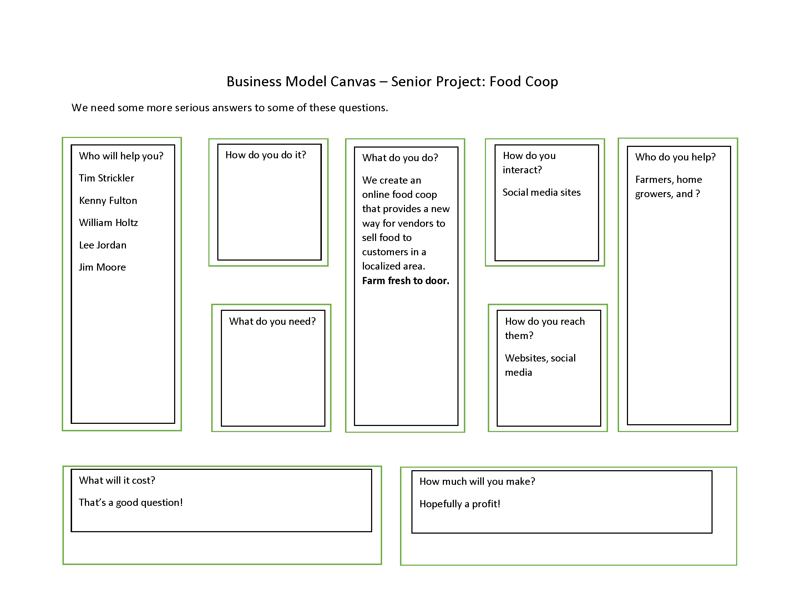
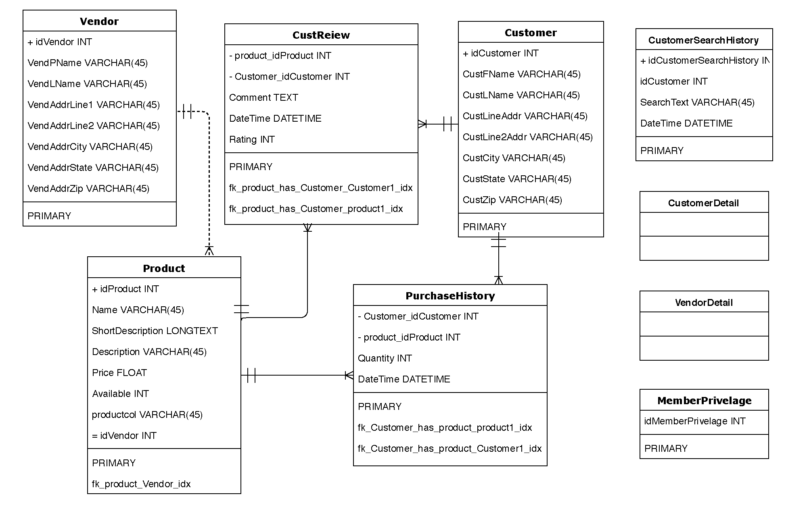

# Online Farmers Market

## Class:
CMPS - 480 - Summer II 2019

## Group Members:
* Tim
* Lee
* Jim Moore
* ?

## Project Objectives:
The objective of our project is to create a website that provides an 
online outlet as an Online Farmers Market. This site will give customers and
vendors the opportunity to purchase farm fresh foods that are localized to the 
customers area.

## Use Cases:
[orientation=landscape]

## GitHub File Structure:
Documentation - Contains documents uploaded by group members.
Database - Contains SQL files used for creating the database and ficticious table content.
Content - Contains the files for the web interface.

## GitHub Branches:
-

## Software Bugs & Fixes
* Website unable to communicate with database.
  - Working on either Tim is going to fix his code.
  - Or, Jim has been working on creating a new node server that uses Embedded JavaSript (EJS).
* Unable to add items to shopping cart.
* Need to update database to enable the storage of images in association with the product.
* 

## Tables:
* Version 1.0 - Included a simple page with a form, but nothing functioned.
* Version 1.0.1 - Built a menu bar, and incorporated BootStrap styling.
* Version 1.0.2 - Expanded on the styling, and creating other pages.
* Version 1.1 - Incorporated simulated backend interaction.

## Changelog:

[cols="15,15,25,60",options="header"]
|=====
^|Item | Version | Issue Description | Resolution

a| 
------
Issue #1 | 1.1.0  |   |  

a| 
------
Issue #2 | 1.1.0 |    | 

a| 
------
Issue #3 | 1.1.0 |    | 

a| 
------
Issue #4 | 1.2.0 |  Database updates  | 

|=====

## Database Diagram
[orientation=landscape]
